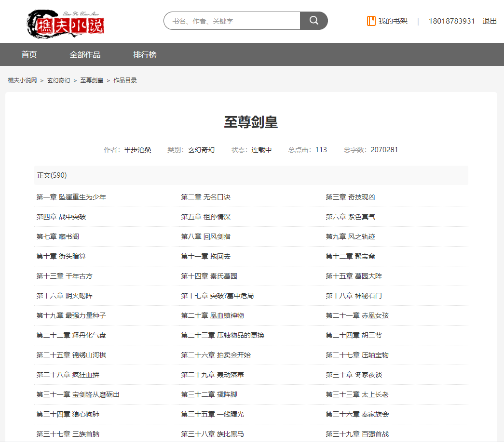

# 樵夫小说网

#### 前言

樵夫小说致力于打造一个完整的开源免费的小说门户平台。

#### 项目介绍

[小说精品屋](https://github.com/201206030/fiction_house)是一个多平台（web、安卓app、微信小程序）、功能完善的小说弹幕网站，包含精品小说专区、轻小说专区和漫画专区。包括小说/漫画分类、小说/漫画搜索、小说/漫画排行、完本小说/漫画、小说/漫画评分、小说/漫画在线阅读、小说/漫画书架、小说/漫画阅读记录、小说下载、小说弹幕、小说/漫画自动爬取、小说内容自动分享到微博、邮件自动推广、链接自动推送到百度搜索引擎等功能。包含电脑端、移动端、微信小程序等多个平台，现已开源web端、安卓端、小程序端源码。

樵夫小说是在小说精品屋的基础上，进行了部分数据库设计、代码重构和功能增强，提升了程序整体的可读性和性能，增加了一些新特性。

#### 项目结构

ly_novel -- 父工程
├── novel-common -- 通用模块
├── novel-front -- 前台门户系统
├── novel-crawl -- 爬虫管理系统
└── novel-admin -- 后台管理系统

#### 技术选型
Springboot+Mybatis+Mysql+Ehcache+Thymeleaf+Layui

#### PC站截图

1.首页

2.小说详情页

3.目录页

4.内容页

#### 手机站截图

1. 首页

   

2. 小说详情页

   

3. 目录页

   

4. 内容页

   

#### 安装步骤

##### 数据库安装：

1. 安装MySQL软件。
2. 修改MySQL`max_allowed_packet `配置（建议100M）。
3. 新建数据库，设置编码为utf8mb4。
4. 执行sql/ly_novel.sql脚本文件。

##### 爬虫管理系统安装：

1. 修改novel-common模块下application-dev.yml文件中的数据库的配置。
2. 修改novel-crawl模块下application.yml文件中的管理员账号密码。
3. 启动程序，打开浏览器，默认8081端口访问。
4. 选择已有或新增爬虫源（支持自定义爬虫规则），点击`开启`按钮，开始爬取小说数据。

##### 前台小说门户安装：

1. 修改novel-common模块下application-dev.yml文件中的数据库的配置。
2. 启动程序，打开浏览器，默认8080端口访问。

**喜欢此项目的可以给我的GitHub和Gitee加个Star支持一下 。**

#### 演示地址

[点击前往](http://novel.lyqiaofu.com)（前台门户）

#### 代码仓库

 GitHub仓库地址： https://github.com/yucang52555/ly_novel.git

#### QQ交流群

